# Jenkins Setup on Ubuntu EC2 Instance

This documentation demonstrates how to set up a Jenkins server on an Ubuntu EC2 instance in AWS and configuring the security group to allow external access.
 

## Installation Steps

**Step 1** Update System Packages

`sudo apt update`

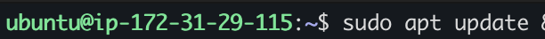

**Step 2**  Install Java (OpenJDK)

JDK stands for ***Java Development Kit**, It is an open software development enviroment used for the development of Java Applications, and it is required for Jenkins because Jenkins runs on Java and depends on it to function.

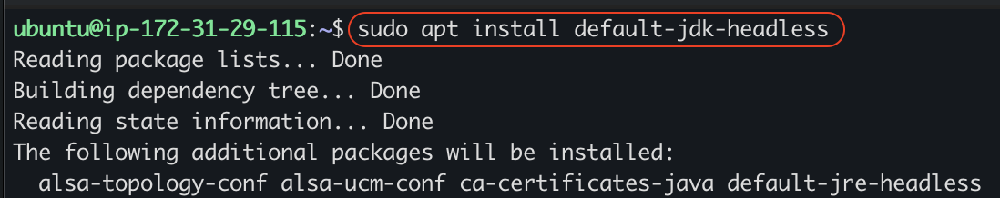

Confirm Java is installed correctly and the version installed:
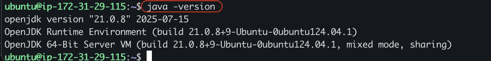

**Step 3**  Add Jenkins Repository & Install Jenkins

On Ubuntu, the default package repository does not include Jenkins. Adding the Jenkins repository tells Ubuntu where to download Jenkins and ensures it installs the latest official version.

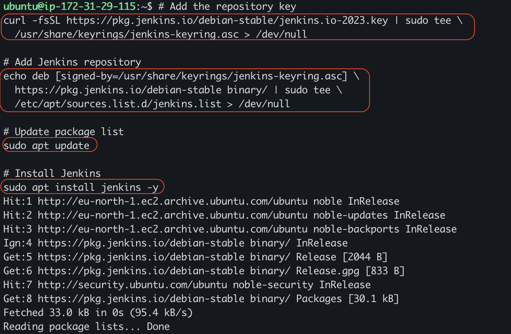

Verify Jenkins Status 
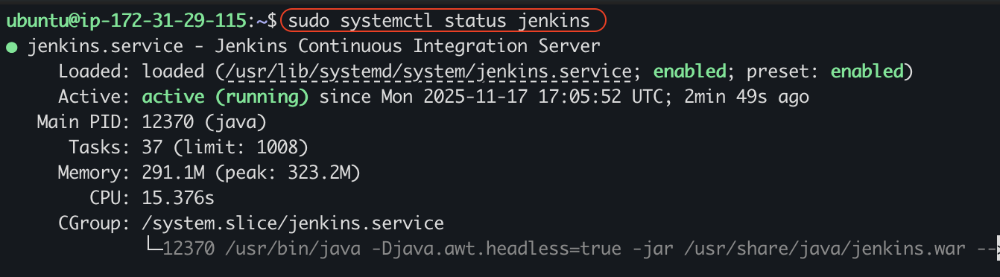

JENKINS INSTALLED SUCCESSFULLY!

### SECURITY GROUP CONFIRGURATION

By default, Jenkins listens on port **8080**. An inbound rule for this port must be added to the security group where Jenkins is hosted to allow external access.

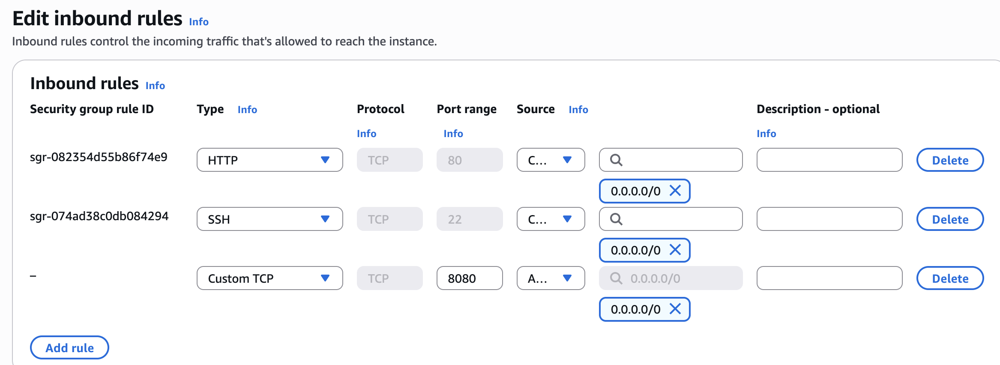

#### Initial Setup
To access the Jenkins server, enter the EC2 instance’s public IP address followed by port 8080 in my browser.
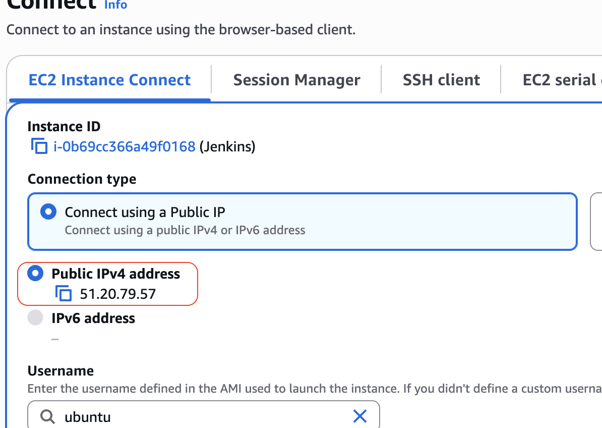

On my browser
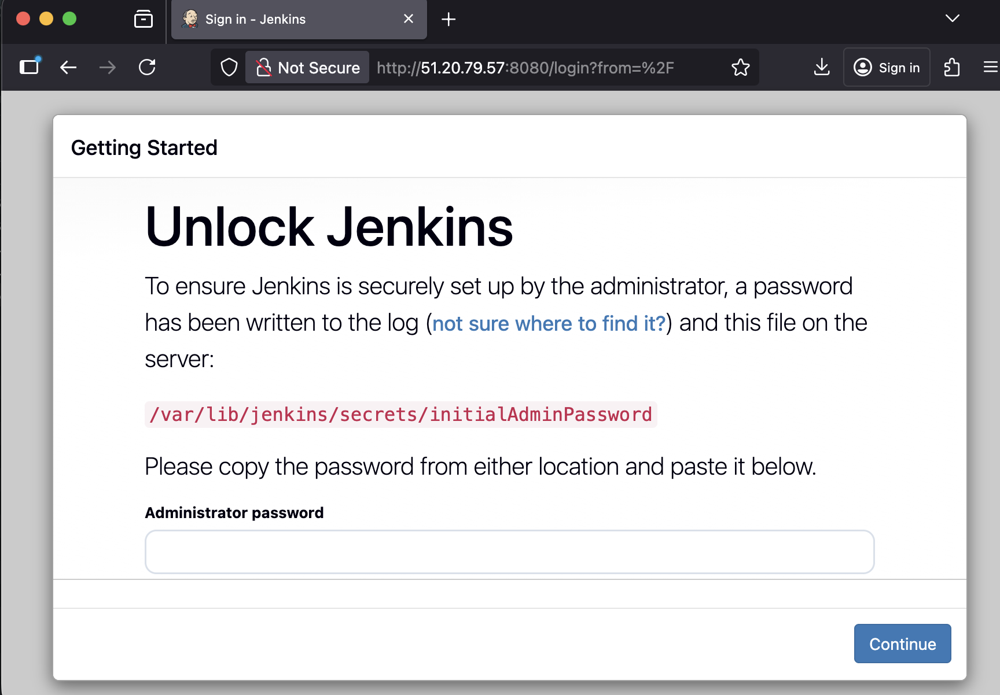

To unlock Jenkins, I ran the command ` sudo cat /var/lib/jenkins/secrets/initialAdminPassword ` to get the password. 

Jenkins is lauched on my browser. 

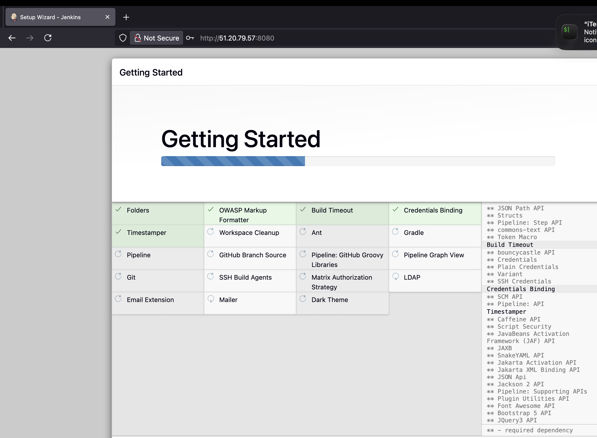

Account setup on my Jenkins Server as well.

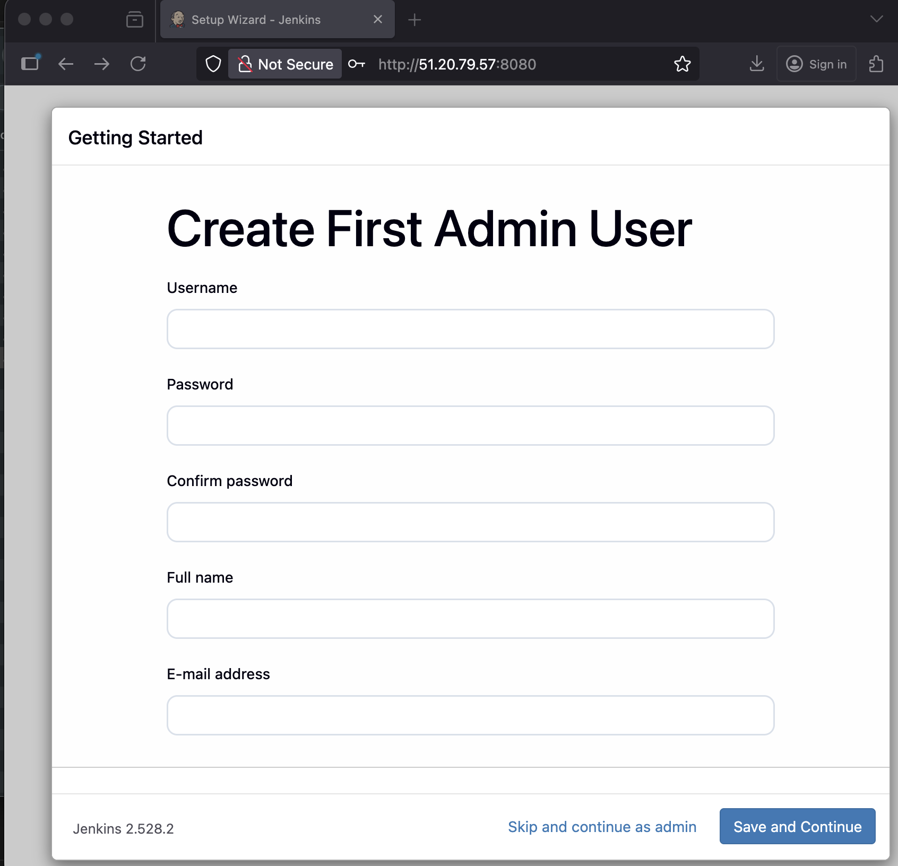

Jenkins now ready and successfully installed!

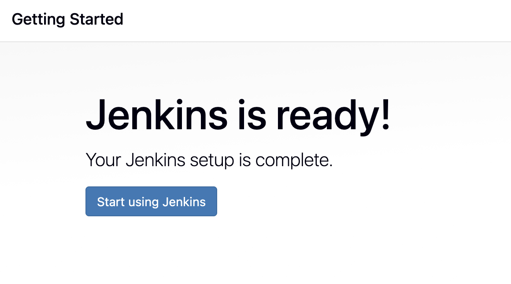

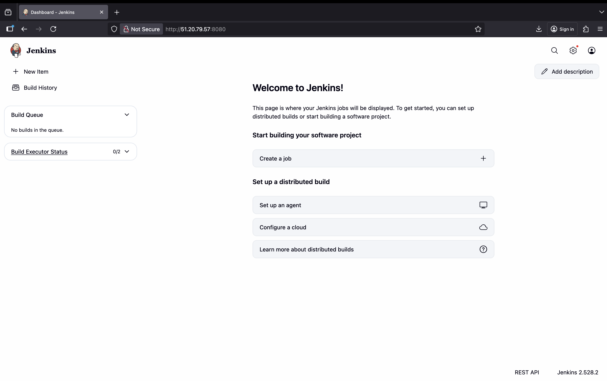

